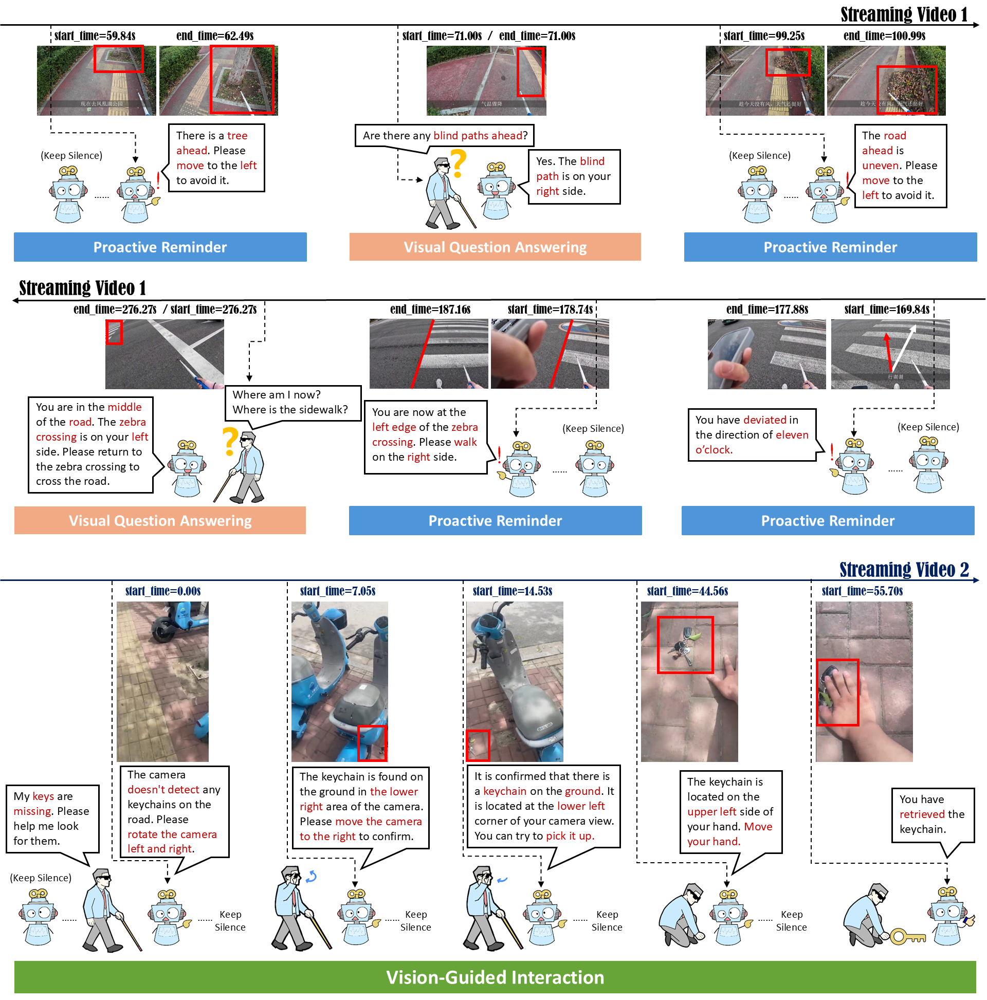

# VIABench

  
  

  

**VIABench** is a comprehensive egocentric video benchmark for evaluating multimodal large language models in real-world visual impairment assistance scenarios. Collected from videos recorded or shared by blind individuals, VIABench contains 761 videos, 46.9 hours of footage, and 14,526 manually curated annotations across three core tasks: Proactive Reminder, Visual Question Answering, and Vision-Guided Interaction.

The benchmark is designed to test whether video MLLMs can provide practical assistance beyond passive video understanding, including real-time reminders, environment-aware question answering, and interactive guidance for user goals.

## TODO

- Update the arXiv link.
- Update the dataset link.
